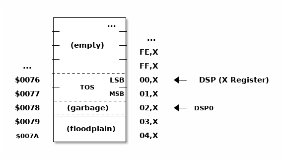

[quote, Doug Hoffman, Some notes on Forth from a novice user]
After spending an entire weekend wrestling with blocks files, stacks, and
the like, I was horrified and convinced that I had made a mistake. Who
in their right mind would want to program in this godforsaken language! <<DH>>

=== Adding New Words

The simplest way to add new words to Tali Forth is to include them in the file
`forth_code/user_words.fs`. This is the suggested place to put them for personal
use.

To add words to the permanent set, it is best to start a pull request on the
GitHub page of Tali Forth. How to setup and use `git` and GitHub is beyond the
scope of this document -- we'll just point out that they are not as complicated as
they look, and they make experimenting a lot easier.

During development, Tali Forth tends to follow a sequence of steps for new words:

* If it is an ANS Forth word, first review the standard online. In some cases,
  there is a reference implementation that can be used.

* Otherwise, check other sources for a high-level realization of the word, for
  instance Jonesforth or Gforth. A direct copy is usually not possible (or legally
  allowed, given different licenses), but studying the code provides hints for
  a Tali Forth version.

* Write the word in Forth in the interpreter. After it has been tested
  interactively, add a high-level version to the file `forth_code/forth_words.fs`.

* Add automatic tests for the new word to the test suite. Ideally, there will
  be test code included in the ANS Forth specification. If not, document what
  the test does.

* In a further step, if appropriate, convert the word to
  assembler. This requires adding an entry to `headers.asm` and the
  code itself to `native_words.asm`.  In this first step, it will
  usually be a simple 1:1 sequence of `jsr` subroutine jumps to the
  existing native Forth words.  Some special consideration is needed
  for immediate words, postponed words and the word `does>` (see the
  section on Converting Forth to Assembly for help with these
  situations).

* If appropriate, rewrite all or some of the subroutine jumps in direct
  assembler. Because we have the automatic tests in place, we can be confident
  that the assembly version is correct as well.

However, if you are contributing code, feel free to happily ignore this sequence
and just submit whatever you have.

=== Deeper Changes

Tali Forth was not only placed in the public domain to honor the tradition of
giving the code away freely. It is also to let people play around with it and
adapt it to their own machines. This is also the reason it is (perversely)
over-commented.

To work on the internals of Tali Forth, you will need the Ophis assembler.

==== The Ophis Assembler

Michael Martin's Ophis Cross-Assembler can be downloaded from
http://michaelcmartin.github.io/Ophis/. It uses a slightly different format than
other assemblers, but is in Python and therefore will run on pretty much any
operating system. To install Ophis on Windows, use the link provided above. For
Linux:

----
git clone https://github.com/michaelcmartin/Ophis
cd Ophis/src
sudo python setup.py install
----

Switch to the folder where the Tali code lives, and run the Makefile with a
simple `make` command. This also updates the file listings in the `docs` folder.

Ophis has some quirks. For instance, you cannot use math symbols in label names,
because it will try to perform those operations. Use underscores instead.

==== General Notes

* The X register is used as the Data Stack Pointer (DSP) and should only be used
  if there is no other alternative.

* The Y register, however, is free to be changed by subroutines. This also means
  it should not be expected to survive subroutines unchanged.

* Natively coded words generally should have exactly one point of entry -- the 
  `xt_word` link -- and exactly one point of exit at `z_word`. In may cases,
  this requires a branch to an internal label `_done` right before `z_word`.

* Because of the way native compiling works, the trick of combining
  `jsr`-`rts` pairs to a single `jmp` instruction (usually) doesn't work.

==== Coding Style

Until there is a tool for Ophis assembly code that formats the source file the
way gofmt does for Go (golang), the following format is suggested.

* Tabs are **eight characters long** and converted to spaces.

* Opcodes are indented by **two tabs**.

* Function-like routines are followed by a one-tab indented "function doc string"
  based on the Python 3 format: Three quotation marks at the start, three at the
  end in their own line, unless it is a one-liner. This should make it easier to
  automatically extract the docs for them at some point.

* The native words have a special comment format with lines that start with `##`
  that allows the automatic generation of word lists by a tool in the tools
  folder, see there for details.

* Assembler mnemonics are lower case. I get enough uppercase insanity writing German,
  thank you very much.

* Hex numbers are, however, upper case, such as `$FFFE`. 

WARNING: The Ophis assembler interprets numbers with a leading zero as octal.
This can be an annoying source of errors.

* Numbers in mnemonics are a stripped-down as possible to reduce
  visual clutter: use `lda 0,x` instead of `lda $00,x`.

* Comments are included like popcorn to help readers who are new both to Forth
  and 6502 assembler.

=== Converting Forth to Assembly

When converting a Forth word to assembly, you will need to take the Forth
definition and process it word by word, in order, into assembly.  All of the
words used in the definition need to already be in assembly.

The processing is different for regular, immediate, and postponed words, with
special handling required for the word `does>`.  These are all covered below,
with examples.  Take each word in the definition, determine which type of word
it is, and then follow the steps outlined below for that word type.

Once the word has been converted, a dictionary header needs to be added for it
in headers.asm.  This process is covered in detail at the end of this section.

==== Processing Regular (Non-Immediate) Words

If the definition word you are processing is not immediate (you can check this
with `see`, eg. `see dup` and make sure the IM flag is 0) then it just
translates into a JSR to the xt (execution token) of that word.  The xt is just
a label that begins with `xt_` followed by the name (spelled out, in the case of
numbers and symbols) of the word.

As an example, let's turn the following definition into assembly:

---- 
: getstate state @ ; 
---- 
Translates into: 
---- 
; ## GETSTATE ( -- n ) "Get the current state" 
; ## "getstate" coded Custom 
.scope 
xt_getstate: 
                jsr xt_state
                jsr xt_fetch ; @ is pronounced "fetch" in Forth.
z_getstate: 
                rts 
.scend 
----

The above code would be added to native_words.asm, probably right after
get-order.  native_words.asm is roughly in alphabetical order with a few odd
words that need to be close to each other.

The header above the code is in a special format used to track where words come
from and their current status.  It is parsed by a tool that helps to track
information about the words, so the format (including the ##s) is important.
The first line has the name (which is uppercase, but needs to match whatever
comes after the xt_ and z_ in the labels below it), the input and output stack
parameters in standard Forth format, and a string that has a short description
of what the word does.  The second line has a string showing the name as it
would be typed in Forth (useful for words with symbols in them), the current
testing status (coded, tested, auto), and where the word comes from (ANS,
Gforth, etc.)  See the top of native_words.asm for more information on the
status field, but "coded" is likely to be the right choice until you've
thoroughly tested your new word.

The `.scope` and `.scend` are special directives to the Ophis assembler to
create a scope for local labels.  Local labels begin with an underscore "_" and
are only visible within the same scope.  This allows multiple words to all have
a `_done:` label, for example, and each word will only branch to its own local
version of `_done:` found within its scope.  Any branching within the word
(eg. for ifs and loops) should be done with local labels.  Labels without an
underscore at the beginning are globally available.

The labels xt_xxxx and z_xxxx need to be the entry and exit point, respectively,
of your word.  The xxxx portion should be your word spelled out (eg. numbers and
symbols spelled out with underscores between them).  Although allowed in the
Forth word, the dash "-" symbol is not allowed in the label (the assembler will
try to do subtraction), so it is replaced with an underscore anywhere it is
used.  The one and only RTS should be right after the z_xxxx label.  If you need
to return early in your word, put a `_done:` label just before the z_xxxx label
and branch to that.

You can see that the body is just a sequence of JSRs calling each existing word
in turn.  If you aren't sure of the xt_xxxx name of a forth word, you can search
native_words.asm for the Forth word (in lowercase) in double quotes and you will
find it in the header for that word.  `xt_fetch`, above, could be found by
searching for "@" (including the quotes) if you didn't know its name.

==== Processing Immediate Words

To determine if a word is immediate, use the word `see` on it (eg. `see [char]`
for the example below).  Processing an immediate word takes a little more
detective work.  You'll need to determine what these words do to the word being
compiled and then do it yourself in assembly, so that only what is actually
compiled into the word (in forth) shows up in your assembly.  Some immediate
words, such as `.(` don't have any affect on the word being compiled and will
not have any assembly generated.

Let's start with the simple example:
----
: star [char] * emit ;
----

The fact that [char] is a square-bracketed word is a strong hint that it's an
immediate word, but you can verify this by looking at the IM flag using `see
[char]`.  This word takes the next character (after a single space) and compiles
instructions to put it on the stack.  It also uses up the * in the input.  It
will need to be replaced with the final result, which is code to put a * on the
stack.  Checking emit shows that it's a normal (non-immediate) word and will be
translated into assembly as a JSR.

When we go to add our word to native_words.asm, we discover that the name
xt_star is already in use (for the multiplication word `*`), so this will show how
to deal with that complication as well.  

---- 
; ## STAR_WORD ( -- ) "Print a * on the screen" 
; ## "star" coded Custom 
.scope 
xt_star_word: 
                ; Put a * character on the stack.  
                dex             ; Make room on the data stack.  
                dex 
                lda #42         ; * is ASCII character 42.
                sta 0,x         ; Store in low byte of stack cell.
                stz 1,x         ; high byte is zeroed for characters.
                jsr xt_emit     ; Print the character to the screen.
z_star_word: 
                rts 
.scend 
----

We chose the labels xt_star_word and z_star_word for this word, but it will be
named "star" in the dictionary and Tali won't confuse it with `\*` for
multiplication.  The `[char] *` portion of the definition has the behavior of
compiling the instructions to put the character "*" on the stack.  We translate
that into the assembly that does that directly.  The word `emit` is a normal
word, and is just translated into a JSR.

==== Processing Postponed Words

Postponed words in a definition are very easy to spot because they will have the
word `POSTPONE` in front of them.  You will still need to determine if the word
being postponed is immediate or not, as that will affect how you translate it
into assembly.

If the word being postponed is an immediate word, then it is very simple and
translates to just a JSR to the word being postponed.  In this case, the word
POSTPONE is being used to instruct Forth to compile the next word rather than
running it (immediately) when it is seen in the forth definition.  Because your
assembly is the "compiled" version, you just have to include a call to the word
being postponed.

If the word being postponed is a regular word, then you need to include assembly
to cause that word to be compiled when your word is run.  There is a helper
function `cmpl_subroutine` that takes the high byte of the address in Y and the
low byte in A to help you out with this.

We'll take a look at the Forth word `IS` (used with deferred words) because it
has a mix of regular, postponed immediate, and postponed regular words without
being too long.  The definition in Forth looks like:

----
: is state @ if postpone ['] postpone defer! else ' defer! then ; immediate
----

This has an `IF` in it, which we will need to translate into branches and will
be a good demonstration of using local labels.  This word has stateful behavior
(eg. it acts differently in INTERPRET mode than it does in COMPILE mode).  While
we could translate the "state @" portion at the beginning into JSRs to xt_state
and xt_fetch, it will be much faster to look in the state variable directly in
assembly.  You can find all of the names of internal Tali variables in
definitions.asm.

The assembly version of this (which you can find in native_words.asm as this is
the actual assembly definition of this word) is:

----
; ## IS ( xt "name" -- ) "Set named word to execute xt"
; ## "is"  auto  ANS core ext
        ; """http://forth-standard.org/standard/core/IS"""
.scope
xt_is:
                ; This is a state aware word with different behavior
                ; when used while compiling vs interpreting.
                ; Check STATE
                lda state
                ora state+1
                beq _interpreting
_compiling:
                ; Run ['] to compile the xt of the next word
                ; as a literal.
                jsr xt_bracket_tick

                ; Postpone DEFER! by compiling a JSR to it.
                ldy #>xt_defer_store
                lda #<xt_defer_store
                jsr cmpl_subroutine
                bra _done
_interpreting:
                jsr xt_tick
                jsr xt_defer_store
_done:          
z_is:           rts
.scend
----

In the header, you can see this word is part of the ANS standard in the extended
core word set.  The "auto" means that there are automated tests (in the tests
subdirectory) that automatically test this word.  There is also a link in the
comments (not technically part of the header) to the ANS standard for this word.

The `STATE @ IF` portion of the definition is replaced by checking the state
directly.  The state variable is 0 for interpreting and -1 ($FFFF) for
compiling.  This assembly looks directly in the state variable (it's a 16-bit
variable, so both halves are used to check for 0).  In order to keep the
assembly in the same order as the Forth code, we branch on zero (the `if` would
have been compiled into the runtime code for this branch) to the `else` section
of the code.

The true section of the `if` has two postponed words.  Conveniently (for
demonstration purposes), the first one is an immediate word and the second is
not.  You can see that the first postponed word is translated into a JSR and the
second is translated into a call to cmpl_subroutine with Y and A filled in with
the address of the word being postponed.  Because the true section should not
run the code for the `else` section, we use a BRA to a _done label.

The `else` section of the `if` just has two regular words, so they are just
translated into JSRs.

The `immediate` on the end is handled in the header in headers.asm by adding IM
to the status flags.  See the top of headers.asm for a description of all of the
header fields.

==== Processing DOES>

The word `does>` is an immediate word.  It is commonly used, along with `create`
(which is not immediate and can be processed normally), in defining words.
Defining words in Forth are words that can be used to declare new words.
Because it is likely to be seen in Forth code, its particular assembly behavior
is covered here.

To see how `does>` is translated, we will consider the word `2CONSTANT`:

----
: 2constant ( d -- ) create swap , , does> dup @ swap cell+ @ ;
----

This word is from the ANS double set of words and it creates a new named
constant that puts its value on the stack when it is run.  It's commonly used
like this:

----
12345678. 2constant bignum
bignum d.
----

The . at the end of the number makes it a double-cell (32-bit on Tali) number.

The assembly code for `2CONSTANT` (taken from native_words.asm) looks like:
----
; ## TWO_CONSTANT (C: d "name" -- ) ( -- d) "Create a constant for a double word"
; ## "2constant"  auto  ANS double
        ; """https://forth-standard.org/standard/double/TwoCONSTANT
        ; Based on the Forth code
        ; : 2CONSTANT ( D -- )  CREATE SWAP , , DOES> DUP @ SWAP CELL+ @ ;
        ; """
.scope
xt_two_constant:
                jsr underflow_2

                jsr xt_create
                jsr xt_swap
                jsr xt_comma
                jsr xt_comma
                
                jsr does_runtime    ; does> turns into these two routines.
                jsr dodoes
                
                jsr xt_dup
                jsr xt_fetch
                jsr xt_swap
                jsr xt_cell_plus
                jsr xt_fetch
                
z_two_constant: rts
.scend
----

This word takes an argument, so underflow checking is added right at the top
(and the UF flag is added in headers.asm).  Underflow checking is optional, but
recommended for words that take arguments on the stack.  To add underflow
checking to your word, just call the appropriate underflow checking helper
(underflow_1 to underflow_4) based on how many cells you are expecting (minimum)
on the stack.  If there aren't that many cells on the stack when the word is
run, an error message will be printed and the rest of the word will not be run.

This word takes a double-cell value on the stack, so underflow_2 was used.  The
underflow check must be the first line in your word.

All of the other words other than `does>` in this definition are regular words,
so they just turn into JSRs.  The word `does>` turns into a `jsr does_runtime`
followed by a `jsr dodoes`.

==== Adding the Header in headers.asm

Once your word has been entered into native_words.asm with the appropriate
comment block over it and the xt_xxxx and z_xxxx labels for the entry and exit
points, it is time to add the dictionary header for your word to link it into
one of the existing wordlists.  The words here are not in alphabetical order and
are loosely grouped by function.  If you aren't sure where to put your word, then
put it near the top of the file just under the header for `cold`.

Each header is simply a declaration of bytes and words that provides some basic
information that Tali needs to use the word, as well as the addresses of the
beginning and ending (not including the rts at the end) of your word.  That's
why you need the xt_xxxx and z_xxxx labels in your word (where xxxx is the
spelled-out version of your word's name).

Before we dicuss adding a word, let's go over the form a dictionary header.  The
fields we will be filling in are described right at the top of headers.asm for
reference. We'll look at an easy to locate word, `cold`, which is used to
perform a cold reset of Tali. It's right near the top of the list.  We'll also
show the word `ed`, which is currently below `cold`, because you will need to
modify it (or whatever word is currently just below `cold`) when you put your
word under `cold`.  The headers for these two words currently look like:

----
nt_cold:
        .byte 4, 0
        .word nt_bye, xt_cold, z_cold
        .byte "cold"

nt_ed:                  ; ed6502
        .byte 2, NN
        .word nt_cold, xt_ed, z_ed
        .byte "ed"
----

The first component of a dictionary header is the label, which comes in the form
nt_xxxx where xxxx is the spelled out version of your word's name.  The xxxx
should match whatever you used in your xt_xxxx and z_xxxx labels.

The next two fields are byte fields, so we create them with the Ophis assembler
`.byte` directive.  The first field is the length of the name, in characters, as
it will be typed in Tali.  The second field is the status of the word, where
each bit has a special meaning.  If there is nothing special about your word,
you will just put 0 here.  If your word needs some of the status flags, you add
them together (with +) here to form the status byte.  The table below gives the
constants you will use and a brief description of when to use them.

[horizontal]
CO:: Compile Only.  Add this if your word should only be allowed when compiling
other words.  Tali will print an error message if the user tries to run this
word in interpreted mode.
IM:: Immediate Word.  Add this when a word should always be run rather than
compiled (even when in compiling mode).
NN:: Never Native Compile (must always be called by JSR when compiled).  Add
this when your word contains a JMP instruction, or if it plays with the return
address it is called from.
AN:: Always Native Compile (will be native compiled when compiled).  
The opcodes for this word will be copied (native compiling)
into a new word when this word is used in the definition.  For short simple words that
are just a sequence of JSRs, you can safely set this bit.  This bit should not
be set if the assembly has a JMP instruction in it (see NN above).
Note: If neither NN or AN is set, then the word might be native compiled based
on its size and the value in the Forth variable `nc-limit`.
UF:: Contains underflow check.  If you added a JSR to one of the underflow
checking helper functions, you should set this bit.
HC:: Has CFA (words created by CREATE and DOES> only).  You will probably never
need this bit for words that you write in assembly.

If you created a short word made out of just JSRs with underflow checking at the top, and
you wanted it to be an immediate word, you might put `IM+UF` for this field.

The next line contains three addresses, so the Ophis `.word` directive is used
here.  The first address is the nt_xxxx of the next word in the word list.  The
words are actually listed from bottom to top in this file, so this will be the
nt_xxxx label of the word just above this one in the file.  The second address
is the xt (execution token), or entry point, of your new word.  This will be
your xt_xxxx label for your word.  The third address is the end of your routine,
just before the RTS instruction.  You will use your z_xxxx label here.  The
xt_xxxx and z_xxxx are used as the bounds of your word if it ends up being
natively compiled.

In the sample headers above, you can see that `ed` links to `cold` as the next
word, and `cold` links to `bye` (not shown) as the next word.  When you go to
add your own word, you will need to adjust these linkages.

The last line is the actual name of the word, as it will be typed in forth, in
lowercase.  It uses the Ophis `.byte` directive and Ophis allows literal
strings, so you can just put the name of your word in double-quotes.  If your
word has a double-quote in it, look up `nt_s_quote` in the headers to see how
this is handled.

Although Tali is not case-sensitive, all words in the dictionary headers must be
in lowercase or Tali will not be able to find them.  The length of this string
also needs to match the length given as the first byte, or Tali will not be able
to find this word.

As an example, we'll add the words `star` and `is` from the previous examples.
Technically, `is` is already in the dictionary, but this example will show
you how to create the header for a regular word (`star`) and for one that
requires one of the status flags (`is`).

----
nt_cold:
        .byte 4, 0
        .word nt_bye, xt_cold, z_cold
        .byte "cold"

nt_star:
        .byte 4, 0
        .word nt_cold, xt_star_word, z_star_word
        .byte "star"

nt_is:
        .byte 2, IM
        .word nt_star, xt_is, z_is
        .byte "is"

nt_ed:                  ; ed6502
        .byte 2, NN
        .word nt_is, xt_ed, z_ed
        .byte "ed"
----

The first thing to note is the updated linked list of words.  In order to put
the new words between `ed` and `cold`, we make `ed` link to `is`, which then
links to `star`, and that links back to `cold`.  Because this file links the
headers from the bottom to the top of the file, this actually places the new
words near the end of the dictionary.  If you use the `words` command, you will
find the new words near the end of the list.

The second thing to note is the status byte of each word.  If the word doesn't
need any special status, then just use 0.  Neither of our added words contain
the JMP instruction (branches are OK, but JMP is not), so neither is required to
carry the NN (Never Native) flag.  The word `is`, in it's original Forth form,
was marked as an immediate word, and we do that by putting the IM flag on it
here in the dictionary header.

=== Code Cheat Sheets

[quote, Leo Brodie, Thinking Forth]
Programming computers can be crazy-making. <<LB2>>

==== The Stack Drawing

This is your friend and should probably go on your wall or something.

==== Coding Idioms

[quote, Charles Moore, The Evolution of FORTH, an Unusual Language]
The first modern FORTH was coded in FORTRAN. Shortly thereafter it was recoded
in assembler. Much later it was coded in FORTH. <<CHM2>>

While coding a Forth, there are certain assembler fragments that get repeated
over and over again. These could be included as macros, but that can make the
code harder to read for somebody only familiar with basic assembly.

Some of these fragments could be written in other variants, such as the "push
value" version, which could increment the DSP twice before storing a value. We
try to keep these in the same sequence (a "dialect" or "code mannerism" if you
will) so we have the option of adding code analysis tools later.

* `drop` cell of top of the Data Stack 

----
                inx
                inx
----

* `push` a value to the Data Stack. Remember the Data Stack Pointer (DSP, the
  X register of the 65c02) points to the LSB of the TOS value.

---- 
                dex
                dex
                lda <LSB>      ; or pla, jsr key_a, etc.
                sta 0,x
                lda <MSB>      ; or pla, jsr key_a, etc.
                sta 1,x
----

* `pop` a value off the Data Stack

----
                lda 0,x
                sta <LSB>      ; or pha, jsr emit_a, etc
                lda 1,x
                sta <MSB>      ; or pha, jsr emit_a, etc
                inx
                inx
----

==== vim Shortcuts

One option for these is to add abbreviations to your favorite editor, which
should of course be vim, because vim is cool. There are examples farther down.
They all assume that auto-indent is on and we are two tabs into the code, and
use `#` at the end of the abbreviation to keep them separate from the normal
words. My `~/.vimrc` file contains the following lines for work on `.asm` files:

----
ab drop# inx<tab><tab>; drop<cr>inx<cr><left>
ab push# dex<tab><tab>; push<cr>dex<cr>lda $<LSB><cr>sta $00,x<cr>lda $<MSB><cr>sta $01,x<cr><up><up><u>
ab pop# lda $00,x<tab><tab>; pop<cr>sta $<LSB><cr>lda $01,x<cr>sta $<MSB><cr>inx<cr>inx<cr><up><up><up>>
----

