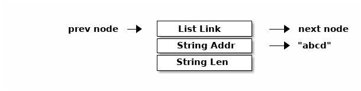

[quote, B. W. Kernighan, A Tutorial Introduction to the UNIX Text Editor]
Ed makes no response to most commands – there is no prompting or typing of
messages like "ready". (This silence is preferred by experienced users, but
sometimes a hangup for beginners.) <<BWK>>

Tali Forth 2 currently ships with a clone of the `ed` line-based editor of Unix
fame. It is envoked with `ed`, though the formal name is `ed6502`. 

TIP: `ed` uses about 2 KB of ROM in the default setup. If you know for certain
you are not going to be using it, you can reclaim that space by commenting out
the line `.require "ed.asm"` in `taliforth.asm` and the subroutine jump 
`jsr ed6502` for the `ed` command in `native_words.asm`.

For those not familiar with `ed`, there is <<ed-tutorial,a tutorial>> included
in this manual. This section is a brief overview of the currently available
functions.

==== Supported Commands

`ed` currently supports only a small number of the commands of the Unix version:

[horizontal]
a:: Add new lines below given line
d:: Delete line
f:: Show current target address for writes (`w`)
i:: Add new lines above given line
q:: Quit if no unsaved work
Q:: Unconditional quit, unsaved work is lost
w:: Write text to given memory location (eg `7000w`)
=:: Print value of given parameter (eg `$=` gives number of last line)

The following parameters are currently available:

[horizontal]
 .:: Current line number
,:: When alone: All lines, the same as `1,$` or `%`
;:: Range from current line to end, same as `.,$`
$:: Last line
%:: All lines, the same as `1,$` or `,` alone

An empty line (pressing the ENTER key) will advance by one line and print it. A
simple number will print that line without the line number and make that line
the new current line.

==== Future planned commands

These are subject to available memory. There is also no time frame for these
additions. 

[horizontal]
+:: Advance by one line, print it and make it the new current line
-:: Go back by one line, print it and make it the new current line
c:: Change a line, possibly adding new lines
e:: Edit lines given as `addr,u` in text buffer
j:: Join two lines to a new line
m:: Move block of text to new line
r:: Append text from a block to end of text buffer
s:: Substitute one string on line with another
!:: Execute a shell command (Forth command in our case)
#:: Comment, ignore rest of the line

==== Differences to Unix ed

Apart from missing about 90 percent of the features:

- The `w` (write) command takes its parameter before and not after the word.
  Where Unix ed uses the format `w <FILENAME>`, ed6502 takes the address
  to write the text to as `7000w`.

WARNING: `ed` currently only works with decimal numbers. When in doubt, use
`decimal` to make sure your using base ten.

==== Using `ed` for programming

`Ed` can be used to write programs and then execute them with `evaluate`. For
instance, a session to add a small string could look something like this:

----
        ed
        a
        .( Shepard, is that ... You're alive?)
        .
        7000w <1>
        22    <2>
        q
----
<1> Address we save the command to
<2> Number of characters saved including final line feed

It is a common mistake to forget the `.` (dot) to end the input, and try to
go immediately to saving the text. Then, we can run the program:

----
        evaluate
----

Ǹote that `evaluate` will handle line feeds, carriage returns and other white
space apart from simple spaces without problems.

==== Known Issues

===== Memory use

`Ed` currently uses memory without releasing it when done. For small, quick
edits, this probably is not a problem. However, if you known you are going to be
using more memory, you probably will want to set a marker first.

----
        marker pre-edit <1>
        ed              <2>
        pre-edit        <3>
----
<1> Set marker at current value of `here`
<2> Edit normally
<3> Call marker, releasing memory

This issue might be taken care of in a future release.

===== Address of Saved Text

`Ed` returns the address of the saved text on the stack as `( -- addr u )`.  If
nothing is saved, the program would return a zero length as TOS.

==== Developer Information

The "buffer" of `ed` is a simple single-linked list of nodes, consisting of a pointer
to the next entry, a pointer to the string address, and the length of that
string. 

Each entry is two bytes, making six bytes in total for each node. A
value of 0000 in the pointer to the next address signals the end of the list.
The buffer starts at the point of the `cp` (accessed with the Forth word `here`)
and is only saved to the given location when the `w` command is given.
