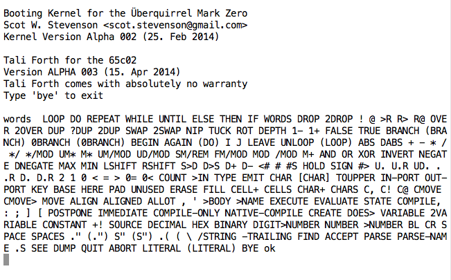

What happened to Tali Forth 1 anyway?::
        Tali Forth 1(((Tali Forth 1))), informally just Tali Forth, was my first Forth.
        As such, it is fondly remembered as a learning experience. You can still find
        it online at GitHub(((GitHub))) at https://github.com/scotws/TaliForth. When
        Tali Forth 2 entered BETA, Tali Forth was discontinued. It does not
        receive bug fixes. In fact, new bugs are not even documented.

[#img_talialpha]
.Screenshot of the Tali Forth 1 boot screen, version Alpha 3, April 2014

Who's "Tali"?::
        I like the name, and we're probably not going to have any more kids I can give
        it to. If it sounds vaguely familiar, you're probably thinking of Tali'Zorah vas
        Normandy((("vas Normandy, Tali'Zorah"))) a character in the _Mass
        Effect_ (((Mass Effect))) universe created by BioWare(((BioWare))). This
        software has absolutely nothing to do with neither the game nor the companies and
        neither do I, expect that I've played the whole series and enjoyed it.footnote:[Though I do
        wish they would tell us what happened to the quarian ark in _Andromeda_.]

And who is "Liara"?(((Liara Forth)))::
        Liara Forth is another STC Forth for the big sibling of the 6502, the
        65816(((65816))). Tali Forth 1(((Tali Forth 1))) came first, then I wrote Liara
        with that knowledge and learned even more, and now Tali 2 is such much better
        for the experience. And yes, it's another _Mass Effect_ (((Mass Effect)))
        character.

