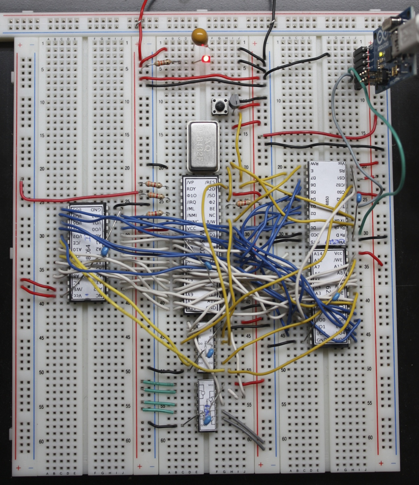

=== Downloading

Tali Forth 2 lives on GitHub(((GitHub))) at
https://github.com/scotws/TaliForth2. This is where you will always find the
current version. You can either clone the code with git(((git))) or simply
download it. To just test Tali Forth, all you need is the binary file
`taliforth-py65mon.bin`.

=== Running 

==== Downloading the py65mon Simulator

Tali was written to run out of the box on the py65mon simulator from
https://github.com/mnaberez/py65.(((py65mon))) This is a Python(((Python)))
program that should run on various operating systems. Py65mon is also required
for the test suite.

To install py65mon on Linux(((Linux))), use one of the following commands

[source,bash]
----
# Install for only your user:
pip install -U py65 --user

# Install for all users:
sudo pip install -U py65
----

If you don't have `pip`(((pip))) installed, you will have to add it first with
something like `sudo apt-get install python-pip` (Ubuntu Linux). There is a
`setup.py` script as part of the package.

==== Running the Binary

To start the emulator, run:

[source,bash]
----
py65mon -m 65c02 -r taliforth-py65mon.bin
----

Note that the option `-m 65c02` is required, because Tali Forth makes extensive
use of the additional commands of the CMOS version and will not run on a stock
6502 MPU.

=== Installing on Your Own Hardware

The Tali Forth project started out as a way to run Forth on my own 65c02
computer, the Übersquirrel(((Übersquirrel))). Though it soon developed a life of
its own, a central aim of the project is to provide a working, modern Forth that
people can install on their projects. 

[#img_uebersquirrel]
.The functioning Übersquirrel Mark Zero prototype, August 2013. Photo by Scot W. Stevenson

==== The Platform Files

For this to work, you need to go to the `platform` folder and create your own
kernel(((kernel))) code to replace `platform-py65mon.asm`, the default kernel
for use with the py65mon(((py65mon))) kernel. By convention, the name should
start with `platform-`. See the `README.md` file in the the `platform` folder
for details.

Once you have configured your platform file in the plaform folder, you
can build a binary (typically programmed into an EEPROM) for your
hardware with make.  If you made a platform file named
`platform-mycomp.asm`, then you should `cd` to the main Tali folder 
and run

[source,bash]
----
make taliforth-mycomp.bin
----

The bin file will be created in the main folder.  You should, of
course, replace the "mycomp" portion of that command with whatever you
named your platform.

=== Hardware Projects with Tali Forth 2

This is a list of projects known to run Tali Forth 2. Please let me know if you
want to have your project added to the list.

- *Steckschwein* (https://steckschwein.de/) by Thomas Woinke and Marko
  Lauke. A multi-board 8 MHz 65c02 system. Platform file:
  `platform-steckschwein.asm` (26. Oct 2018)

- *SamCo's SBC* (https://github.com/SamCoVT/SBC) by Sam Colwell.  A
   single-board computer running at 4MHz.  Platform file:
   `platform-sbc.asm` (29. Oct 2018)

There are various benchmarks of Tali Forth 2 running different hardware at _The
Ultimate Forth Benchmark_ (https://theultimatebenchmark.org/#sec-7).
