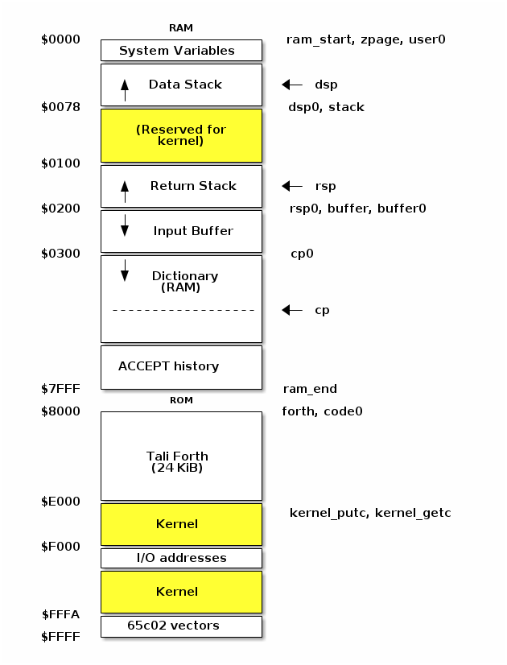
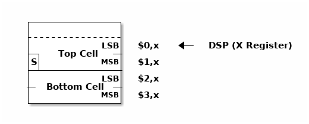
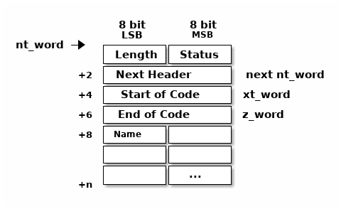

[quote, Dennis M. Ritchie, Reflections on Software Research]
Our intent was to create a pleasant computing environment
for ourselves, and our hope was that others liked it. <<DMR>>

=== Memory Map

Tali Forth can be configured to work with various memory layouts and amounts of
RAM and ROM. Out of the box, the version that runs with the py65 emulator looks
like this:

Note that some of these values are hard-coded into the test suite; see the file
`definitions.txt` for details.

=== The Data Stack

Tali Forth uses the lowest part of the top half of the Zero Page((("Zero
Page"))) for the Data Stack (DS). This leaves the lower half of the Zero Page
for any kernel stuff the user might require. The DS grows towards the initial
user variables. See the file `definitions.asm` for details. Because of the
danger of underflow,(((underflow))) it is recommended that the user kernel's
variables are kept closer to $0100 than to $007F.

The X register((("X register"))) is used as the Data Stack Pointer (DSP). It
points to the least significant byte of the current top element of the stack
("Top of the Stack", TOS).

NOTE: In the first versions of Tali Forth 1, the DSP pointed to the next _free_
element of the stack. The new system makes detecting underflow easier and
follows the convention in Liara Forth.(((Liara)))

Initially, the DSP points to $78, not $7F as might be expected. This provides a
few bytes as a "floodplain" for underflow.(((underflow))) The initial value of
the DSP is defined as `dsp0` in the code.

==== Single Cell Values

Since the cell size is 16 bits, each stack entry consists of two bytes. They are
stored little endian (least significant byte first). Therefore, the DSP points
to the LSB of the current TOS. footnote:[Try reading that last sentence to a
friend who isn't into computers. Aren't abbreviations fun?]

Because the DSP points to the current top of the stack, the byte it points to
after boot -- `dsp0` -- will never be accessed: The DSP is decremented first
with two `dex` instructions, and then the new value is placed on the stack.
This means that the initial byte is garbage and can be considered part of the
floodplain.

.Snapshot of the Data Stack with one entry as TOS. The DSP has been increased by one and the value written.
image::pics/stack_diagram.png[]

Note that the 65c02 system stack -- used as the Return Stack (RS) by Tali --
pushes the MSB on first and then the LSB (preserving little endian), so the
basic structure is the same for both stacks. 

Because of this stack design, the second entry ("next on stack", NOS) starts at
`02,X` and the third entry ("third on stack", 3OS) at `04,X`. 

==== Underflow Detection

Most native words come with built-in underflow detection. This is realized with
a subroutine jump to specialized routines for the number of cells (not: bytes)
that are expected on the Data Stack. For example, a word such as `drop` starts
with the test:

----
                jsr underflow_1
----

Underflow detection adds three bytes and 16 cycles to the words that have it.
However, it increases the stability of the program. There is an option for
stripping it out during for user-defined words (see below).

Tali Forth does not check for overflow, which in normal operation is too rare
to justify the computing expense. 

==== Double Cell Values

The double cell is stored on top of the single cell. 

Note this places the sign bit of the double cell number (*S*) at the beginning
of the byte below the DSP.

=== Dictionary

Tali Forth follows the traditional model of a Forth dictionary -- a linked list
of words terminated with a zero pointer. The headers and code are kept separate
to allow various tricks in the code.

==== Elements of the Header

Each header is at least eight bytes long: 

Each word has a `name token` (nt, `nt_word` in the code) that points to the
first byte of the header. This is the length of the word's name string, which
is limited to 255 characters. 

The second byte in the header (index 1) is the status byte. It is created by
the flags defined in the file `definitions.asm`: 

[horizontal]
CO:: 
  *Compile Only.* This word may only be used inside definitions of new words.
IM:: 
  *Immediate.* This Word is executed immediately during definitions of new words.
NN:: 
  *Never Native.* This Word is never inlined. Usually means that the return address
  from a subroutine jump is required for processing.
AN:: 
  *Always Native.* This word must always be inlined.
UF:: 
  *Undeflow Detection.* This word checks for Data Stack underflow before it is
  executed. 
HC::
  *Has CFA.* Consider first three bytes of the word's code the Code Field 
  Area (CFA) of the word. Used by words defined with `create` so `>body` returns
  the correct value.

Note there are currently two bits unused. 

The status byte is followed by the **pointer to the next header** in the linked
list, which makes it the name token of the next word. A 0000 in this position
signals the end of the linked list, which by convention is the word `bye` for
the native code words.

This is followed by the current word's **execution token** (xt, `xt_word`) that
points to the start of the actual code. Some words that have the same
functionality point to the same code block. 

NOTE: Because Tali uses a subroutine threaded model (STC), the classic Forth
distinction between the Code Field Area (CFA) and the Parameter Field Area
(PFA, also Data Field Area) is meaningless -- it's all "payload". 

The next pointer is for the **end of the code** (`z_word`) to enable native
compilation of the word (if allowed and requested). 

The **name string** starts at the eighth byte. The string is _not_
zero-terminated.  Tali Forth lowercases names as they are copied into the 
dictionary and also lowercases during lookup, so `quarian` is the same word as
`QUARIAN`.  If the name in the dictionary is directly modified, it is important
to ensure that only lowercase letters are used, or else Tali will not be able
to find that word.

==== Structure of the Header List

Tali Forth distinguishes between three different word sources: The **native
words** that are hard-coded in the file `native_words.asm`, the **Forth words**
from `forth_words.asm` which are defined as high-level words and then generated
at run-time when Tali Forth starts up, and **user words** in the file
`user_words.asm`. 

Tali has an unusually high number of native words in an attempt to make the
Forth as fast as possible on the 65c02 and compensate for the disadvantages of
the subroutine threading model (STC). The first word on that list -- the one
that is checked first -- is always `drop`, the last one -- the one checked for
last -- is always `bye`. The words which are (or are assumed to be) used more
than others come first. Since humans are slow, words that are used more
interactively like `words` always come later. 

The list of Forth words ends with the intro strings. This functions as a
primitive form of a self-test: If you see the welcome message, compilation of
the Forth words worked.

=== Input 

Tali Forth follows the ANS Forth input model with `refill` instead of older
forms. There are four possible input sources:

* The keyboard ("user input device", can be redirected)
* A character string in memory
* A block file
* A text file

To check which one is being used, we first call `blk` which gives us the number
of a mass storage block being used, or 0 for the one of the other input sources.
In the second case, we use `source-id` to find out where input is coming from:

.Non-block input sources
[%autowidth]
|===
| Value | Source

| 0 | keyboard (can be redirected)
| -1 | string in memory
| `n` | file-id (not currently supported)

|===

The input can be redirected by storing the address of your routine in
the memory location given by the word `input`.  Tali expects this
routine to wait until a character is available and to return the
character in A, rather than on the stack.

The output can similarly be redirected by storing the address of your
routine in the memory location given by the word `output`.  Tali
expects this routine to accept the character to out in A, rather than
on the stack.

Both the input routine and output routine may use the tmp1, tmp2, and
tmp3 memory locations (defined in assembly.asm), but they need to
push/pop them so they can restore the original values before
returning.  If the input or output routines are written in Forth,
extra care needs to be taken because many of the Forth words use these
tmp variables and it's not immediately obvious without checking the
assembly for each word.

==== Booting

The initial commands after reboot flow into each other: `cold` to `abort` to
`quit`. This is the same as with pre-ANS Forths.  However, `quit` now calls
`refill` to get the input.  `refill` does different things based on which of the
four input sources (see above) is active:

[horizontal]
Keyboard entry:: 
	This is the default. Get line of input via `accept` and return `true`
	even if the input string was empty.
`evaluate` string:: Return a `false` flag
Input from a buffer:: _Not implemented at this time_
Input from a file:: _Not implemented at this time_

==== The Command Line Interface (CLI)

Tali Forth accepts input lines of up to 256 characters. The address of the
current input buffer is stored in `cib`. The length of the current buffer is
stored in `ciblen` -- this is the address that `>in` returns.  `source` by
default returns `cib` and `ciblen` as the address and length of the input
buffer.

==== The Word `evaluate`

The word `evaluate`is used to execute commands that are in a string. A simple example:

----
s" 1 2 + ." evaluate 
----

Tali Forth uses `evaluate` to load high-level Forth words from the file
`forth_words.asc` and, if present, any extra, user-defined words from
`user_words.asc`.

=== The Words `create` and `does>`

The tandem of words `create` and `does>` is the most complex, but also most
powerful part of Forth. Understanding how it works in Tali Forth is important
if you want to be able to modify the code. In this text, we walk through the
generation process for a subroutine threaded code (STC) such as Tali Forth. 

NOTE: For a more general explanation, see Brad Rodriguez' series of articles at
http://www.bradrodriguez.com/papers/moving3.htm There is a discussion of this
walkthrough at http://forum.6502.org/viewtopic.php?f=9&t=3153

We start with the following standard example, a high-level Forth version of the
word `constant`.

----
: constant  ( "name" -- )  create , does> @ ; 
----

We examine this in three phases or "sequences", following Rodriguez (based on
<<DB>>).

==== Sequence 1: Compiling the Word `constant`

`constant` is a defining word, one that makes new words. In pseudocode,
ignoring any compilation to native 65c02 assembler, the above compiles to:

----
        jsr CREATE
        jsr COMMA
        jsr (DOES>)         ; from DOES>
   a:   jsr DODOES          ; from DOES>
   b:   jsr FETCH
        rts
----

To make things easier to explain later, we've added the labels `a` and
`b` in the listing.

NOTE: This example uses the traditional word `(does>)`, which in Tali Forth 2
is actually an internal routine that does not appear as a separate word. This
version is easier to explain.

`does>` is an immediate word that adds not one, but two subroutine jumps, one
to `(does>)` and one to `dodoes`, which is a pre-defined system routine like
`dovar`. We'll discuss those later.

In Tali Forth, a number of words such as `defer` are "hand-compiled", that is,
instead of using forth such as

----
: defer create ['] abort , does> @ execute ;
----

we write an optimized assembler version ourselves (see the actual `defer` code).
In these cases, we need to use `(does>)` and `dodoes` instead of `does>` as
well.

==== Sequence 2: Executing the Word `constant`

Now when we execute

----
42 constant life
----

This pushes the `rts` of the calling routine -- call it "main" -- to the
65c02's stack (the Return Stack, as Forth calls it), which now looks like this:

----
        (1) rts                 ; to main routine 
----

Without going into detail, the first two subroutine jumps of `constant` give us
this word: 

----
        (Header "LIFE")
        jsr DOVAR               ; in CFA, from LIFE's CREATE
        4200                    ; in PFA (little-endian)
----

Next, we `jsr` to `(does>)`. The address that this pushes on the Return Stack
is the instruction of `constant` we had labeled `a`. 

----
        (2) rts to CONSTANT ("a") 
        (1) rts to main routine 
----

Now the tricks start. `(does>)` takes this address off the stack and uses it to
replace the `dovar jsr` target in the CFA of our freshly created `life` word.
We now have this: 

----
        (Header "LIFE")
        jsr a                   ; in CFA, modified by (DOES>)
   c:   4200                    ; in PFA (little-endian)
----

Note we added a label `c`. Now, when `(does>)` reaches its own `rts`, it finds
the `rts` to the main routine on its stack. This is a Good Thing(TM), because it
aborts the execution of the rest of `constant`, and we don't want to do
`dodoes` or `fetch` now. We're back at the main routine. 

==== Sequence 3: Executing `life`

Now we execute the word `life` from our "main" program. In a STC Forth
such as Tali Forth, this executes a subroutine jump.

----
        jsr LIFE
----

The first thing this call does is push the return address to the main routine
on the 65c02's stack:

----
        (1) rts to main
----

The CFA of `life` executes a subroutine jump to label `a` in `constant`. This
pushes the `rts` of `life` on the 65c02's stack:

----
        (2) rts to LIFE ("c")
        (1) rts to main
----

This `jsr` to a lands us at the subroutine jump to `dodoes`, so the return
address to `constant` gets pushed on the stack as well. We had given this
instruction the label `b`. After all of this, we have three addresses on the
65c02's stack:

----
        (3) RTS to CONSTANT ("b")
        (2) RTS to LIFE ("c")
        (1) RTS to main
----

`dodoes` pops address `b` off the 65c02's stack and puts it in a nice safe place
on Zero Page, which we'll call `z`. More on that in a moment. First, `dodoes`
pops the `rts` to `life`. This is `c`, the address of the PFA or `life`, where
we stored the payload of this constant. Basically, `dodoes` performs a `dovar`
here, and pushes `c` on the Data Stack. Now all we have left on the 65c02's
stack is the `rts` to the main routine.

----
        [1] RTS to main
----

This is where `z` comes in, the location in Zero Page where we stored address
`b` of `constant`. Remember, this is where the PFA of `constant` begins, the
`fetch` command we had originally codes after `does>` in the very first
definition. The really clever part: We perform an indirect `jmp` -- not a
`jsr`! -- to this address.

----
        jmp (z)
----

Now the little payload program of `constant` is executed, the subroutine jump
to `fetch`. Since we just put the PFA (`c`) on the Data Stack, `fetch` replaces
this by 42, which is what we were aiming for all along.  And since `constant`
ends with a `rts`, we pull the last remaining address off the 65c02's stack,
which is the return address to the main routine where we started. And that's
all.

Put together, this is what we have to code:

`does>`:: Compiles a subroutine jump to `(does>)`, then compiles a subroutine
jump to `dodoes`.

`(does>)`:: Pops the stack (address of subroutine jump to `dodoes` in
`constant`, increase this by one, replace the original `dovar` jump target in
`life`.

`dodoes`:: Pop stack (PFA of `constant`), increase address by one, store on
Zero Page; pop stack (PFA of `life`), increase by one, store on Data Stack;
`jmp` to address we stored in Zero Page.

Remember we have to increase the addresses by one because of the way `jsr`
stores the return address for `rts` on the stack on the 65c02: It points to the
third byte of the `jsr` instruction itself, not the actual return address. This
can be annoying, because it requires a sequence like:

----
        inc z
        bne +
        inc z+1
*       
        (...)
----

Note that with most words in Tali Forth, as any STC Forth, the distinction
between PFA and CFA is meaningless or at least blurred, because we go native
anyway. It is only with words generated by `create` and `does>` where this
really makes sense.

=== Control Flow

==== Branches

For `if` and `then`, we need to compile something called a "conditional forward
branch", traditionally called `0branch`. In Tali Forth, this is not visible to
the user as an actual, separate word anymore, but we can explain things better
if we assume it is still around.

At run-time, if the value on the Data Stack is false (flag is zero), the branch
is taken ("branch on zero", therefore the name). Except that we don't have the
target of that branch yet -- it will later be added by `then`. For this to work,
we remember the address after the `0branch` instruction during the compilation
of `if`. This is put on the Data Stack, so that `then` knows where to compile
it's address in the second step. Until then, a dummy value is compiled after
`0branch` to reserve the space we need.

NOTE: This section and the next one are based on a discussion at
http://forum.6502.org/viewtopic.php?f=9\&t=3176 see there for more details.
Another take on this subject that handles things a bit differently is at
http://blogs.msdn.com/b/ashleyf/archive/2011/02/06/loopty-do-i-loop.aspx 

In Forth, this can be realized by

----
: if  postpone 0branch here 0 , ; immediate
----

and

----
: then  here swap ! ; immediate
----

Note `then` doesn't actually compile anything at the location in memory where
it is at. It's job is simply to help `if` out of the mess it has created. If we
have an `else`, we have to add an unconditional `branch` and manipulate the
address that `if` left on the Data Stack. The Forth for this is:

----
: else  postpone branch here 0 , here rot ! ; immediate
----

Note that `then` has no idea what has just happened, and just like before
compiles its address where the value on the top of the Data Stack told it to --
except that this value now comes from `else`, not `if`.

==== Loops

Loops are more complicated, because we have `do`, `?do`, `loop`, `+loop`,
`unloop`, and `leave` to take care of. These can call up to three addresses: One
for the normal looping action (`loop` and `+loop`), one to skip over the loop at
the beginning (`?do`) and one to skip out of the loop (`leave`).

Based on a suggestion by Garth Wilson, we begin each loop in run-time by saving
the address after the whole loop construct to the Return Stack. That way,
`leave` and `?do` know where to jump to when called, and we don't interfere with
any `if`-`then` structures. On top of that address, we place the limit and start
values for the loop.

The key to staying sane while designing these constructs is to first make
a list of what we want to happen at compile time and what at run time. Let's
start with a simple `do`-`loop`.

===== `do` at compile-time:

* Remember current address (in other words, `here`) on the Return Stack (!) so
  we can later compile the code for the post-loop address to the Return Stack

* Compile some dummy values to reserve the space for said code

* Compile the run-time code; we'll call that fragment (`do`)

* Push the current address (the new `here`) to the Data Stack so `loop` knows
  where the loop contents begin

===== `do` at run-time:

* Take limit and start off Data Stack and push them to the Return Stack

Since `loop` is just a special case of `+loop` with an index of one, we can get
away with considering them at the same time.

===== `loop` at compile time:

* Compile the run-time part `(+loop)`

* Consume the address that is on top of the Data Stack as the jump target for
  normal looping and compile it

* Compile `unloop` for when we're done with the loop, getting rid of the
  limit/start and post-loop addresses on the Return Stack

* Get the address on the top of the Return Stack which points to
  the dummy code compiled by `do`

* At that address, compile the code that pushes the address after the list
  construct to the Return Stack at run-time

===== `loop` at run-time (which is `(+loop)`)

* Add loop step to count

* Loop again if we haven't crossed the limit, otherwise continue after loop

At one glance, we can see that the complicated stuff happens at compile-time.
This is good, because we only have to do that once for each loop.

In Tali Forth, these routines are coded in assembler. With this setup, `unloop`
becomes simple (six `pla` instructions -- four for the limit/count of `do`, two
for the address pushed to the stack just before it) and `leave` even simpler
(four `pla` instructions for the address).

=== Native Compiling

In a pure subroutine threaded code, higher-level words are merely a series of
subroutine jumps. For instance, the Forth word `[char]`, formally defined in
high-level Forth as

----
: [char] char postpone literal ; immediate
----

in assembler is simply

----
                jsr xt_char
                jsr xt_literal
----

as an immediate, compile-only word. There are two problems with this method:
First, it is slow, because each `jsr`-`rts` pair consumes four bytes and 12
cycles as overhead. Second, for smaller words, the jumps use far more bytes than
the actual code. Take for instance `drop`, which in its naive form is simply

----
                inx
                inx
----

for two bytes and four cycles. If we jump to this word as is assumed with pure
subroutine threaded Forth, we add four bytes and 12 cycles -- double the space
and three times the time required by the actual working code. 

(In practice, it's even worse, because `drop` checks for underflow. The actual
assembler code is

----
                jsr underflow_1

                inx
                inx
----

for five bytes and 20 cycles. We'll discuss the underflow checks further below.)

To get rid of this problem, Tali Forth supports **native compiling** (also known
as inlining). The system variable `nc-limit` sets the threshold up to which a
word will be included not as a subroutine jump, but in machine language. Let's
start with an example where `nc-limit` is set to zero, that is, all words are
compiled as subroutine jumps. Take a simple word such as

----
: aaa 0 drop ;
----

when compiled with an `nc-limit` of 0 and check the actual code with `see`

----
nt: 9AE  xt: 9B9
flags (CO AN IM NN UF HC): 0 0 0 1 0 1
size (decimal): 6

09B9  20 1C A7 20 80 8D   .. ..

9B9   A71C jsr
9BC   8D80 jsr
----

(The actual addresses might vary). Our word `aaa` consists of two subroutine
jumps, one to zero and one to `drop`. Now, if we increase the threshold to 20
and define a new word with the same instructions with

----
20 nc-limit !
: bbb 0 drop ;
----

we get different code: 

----
see bbb 
nt: 9C0  xt: 9CB 
flags (CO AN IM NN UF HC): 0 0 0 1 0 1 
size (decimal): 11 

09CB  CA CA 74 00 74 01 20 3D  D6 E8 E8  ..t.t. = ...

9CB        dex
9CC        dex
9CD      0 stz.zx
9CF      1 stz.zx
9D1   D63D jsr
9D4        inx
9D5        inx
----

Even though the definition of `bbb` is the same as `aaa`, we have totally
different code: The number 0001 is pushed to the Data Stack (the first six
bytes), then we check for underflow (the next three), and finally we
`drop` by moving X register, the Data Stack Pointer. Our word is definitely
longer, but have just saved 12 cycles.

To experiment with various parameters for native compiling, the Forth word
`words&sizes` is included in `user_words.fs` (but commented out by default).
The Forth is:

----
: words&sizes ( -- )
        latestnt
        begin
                dup
        0<> while
                dup name>string type space
                dup wordsize u. cr
                2 + @
        repeat
        drop ;
----

An alternative is `see` which also displays the length of a word. One way or
another, changing `nc-limit` should show differences in the Forth
words.

While a new word may have built-in words natively compiled into it, all new
words are flagged Never-Native by default because a word needs to meet some
special criteria to be safe to native compile.  In particular, the word cannot
have any control structures (if, loop, begin, again, etc) and, if written in
assembly, cannot have any JMP instructions in it (except for error handling,
such as underflow detection).  

If you are certain your new word meets these criteria, then you can enable
native compilation of this word into other words by invoking the word
`allow-native` or the word `always-native` immediately after the definition of
your new word.  The `allow-native` will use the `nc-limit` value to determine
when to natively compiled just like it does for the built-in words, and
`always-native` will always natively compile regardless of the setting of
`nc-limit`.

==== Return Stack Special Cases

There are a few words that cause problems with subroutine threaded code (STC):
Those that access the Return Stack such as `r>`, `>r`, `r@`, `2r>`, and `2>r`.
We first have to remove the return address on the top of the stack, only to
replace it again before we return to the caller. This mechanism would normally
prevent the word from being natively compiled at all, because we'd try to remove
a return address that doesn't exit.

This becomes clearer when we examine the code for `>r` (comments
removed):

----
xt_r_from:
                pla
                sta tmptos
                ply

                ; --- CUT FOR NATIVE CODING ---

                dex
                dex
                pla
                sta 0,x
                pla
                sta 1,x

                ; --- CUT FOR NATIVE CODING ---

                phy
                lda tmptos
                pha

z_r_from:       rts
----

The first three and last three instructions are purely for housekeeping with
subroutine threaded code. To enable this routine to be included as native code,
they are removed when native compiling is enabled by the word `compile,` This
leaves us with just the six actual instructions in the center of the routine to
be compiled into the new word.

==== Underflow Stripping

As described above, every underflow check adds three bytes to the word being
coded. Stripping this check by setting the `strip-underflow` system variable
(named `uf-strip` in the source code) to `true` simply removes these three bytes
from new natively compiled words.

It is possible, of course, to have lice and fleas at the same time. For
instance, this is the code for `>r`:

----
xt_to_r:
                pla
                sta tmptos
                ply

                ; --- CUT HERE FOR NATIVE CODING ---

                jsr underflow_1

                lda 1,x
                pha
                lda 0,x
                pha

                inx
                inx

                ; --- CUT HERE FOR NATIVE CODING ---

                phy
                lda tmptos
                pha

z_to_r:         rts
----

This word has _both_ native compile stripping and underflow detection. However,
both can be removed from newly native code words, leaving only the eight byte
core of the word to be compiled.

==== Enabling Native Compling on New Words

By default, user-defined words are flagged with the Never-Native (NN)
flag.  While the words used in the definition of the new word might
have been natively compiled into the new word, this new word will
always be compiled with a JSR when used in future new words.  To
override this behavior and allow a user-defined word to be natively
compiled, the user can use the `always-native` word just after the
definition has been completed (with a semicolon).  An example of doing
this might be:

----
: double dup + ; always-native
----

Please note adding the always-native flag to a word overrides the
never-native flag and it also causes the word to be natively compiled
regardless of the setting of `nc_limit`.

WARNING: Do not apply always-native to a word that has any kind of
control structures in it, such as `if`, `case` or any kind of loop.
If these words ever get native compiled, the JMP instructions used in
the control structures are copied verbatim, causing them to jump back
into the original words.

WARNING: When adding your own words in assembly, if a word has a `jmp`
instruction in it, it should have the NN (Never Native) flag set in the
headers.asm file and should never have the AN (Always Native) flag set.

=== `cmove`, `cmove>` and `move`

The three moving words `cmove`, `cmove>` and `move` show subtle differences
that can trip up new users and are reflected by different code under the hood.
`cmove` and `cmove>` are the traditional Forth words that work on characters
(which in the case of Tali Forth are bytes), whereas `move` is a more modern
word that works on address units (which in our case is also bytes).

If the source and destination regions show no overlap, all three words work the
same. However, if there is overlap, `cmove` and `cmove>` demonstrate a behavior
called "propagation" or "clobbering" : Some of the characters are overwritten.
`move` does not show this behavior. This example shows the difference:

----
create testbuf  char a c,  char b c,  char c c,  char d c,  ( ok )
testbuf 4 type  ( abcd ok )
testbuf dup char+ 3  cmove  ( ok )
testbuf 4 type ( aaaa ok )
----

Note the propagation in the result. `move`, however, doesn't propagate.
The last two lines would be:

----
testbuf dup char+ 3  move  ( ok )
testbuf 4 type  ( aabc ok )
----

In practice, `move` is usually what you want to use.
