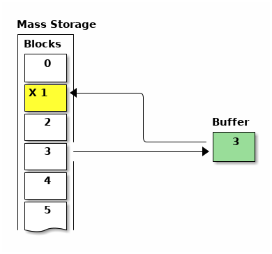

Blocks are a simple system for dealing with non-volatile storage.  Originally,
the storage medium would have been a floppy disk drive, but hobbyists are more
likely to attach I2C or SPI flash memory to their system.  These storage devices
often have more than 64K (the full address space of the 65C02) of storage, so
the block words help to deal with the larger address space and the fact that
there is a limited amount of RAM in the system.

The block words do not use a file system and expect to access the storage memory
directly.  The storage space is divided into 1K chunks, or "blocks", and each is
given a number.  On Tali, this allows for 64K blocks, or up to 64MB of storage.
The user can request that a block is brought into RAM, operate on the data, and
then request that the modified version be saved back to storage.

What the blocks hold is up to the user.  They can hold text, Forth code, or
binary data.  Support for text and Forth code is provided by Tali, and the user
can easily provide support for storing binary data in their programs, as
demonstrated in this chapter.

=== First steps with blocks

In order to facilitate playing with blocks, Tali comes with a special word
`block-ramdrive-init` that takes the number of blocks you want to use and
allocates a RAM drive to simulate a mass-storage device.  It also sets up the
read and write vectors to routines that will move the data in and out of the
allocated RAM.

If you have an actual storage device, such as a flash memory, you will need to
write routines for transferring 1K from storage to RAM and from RAM to storage.
The addresses (xt) of these routines need to be placed in the existing variables
`BLOCK-READ-VECTOR` and `BLOCK-WRITE-VECTOR`, respectively.

To get started on this tutorial, we will use the ramdrive with 4 blocks
allocated.  If you forget this step, you will see an error message about
BLOCK-READ-VECTOR and BLOCK-WRITE-VECTOR when you try to use any of the block
words.

----
4 block-ramdrive-init
----

This command takes a moment as all of the block memory is initialized to the
value BLANK (a space) on the assumption you will be placing text there.  When
complete, you will have 4 blocks (numbered 0-3) available to play with.

When using blocks for text or Forth code, the 1K block is further divided into
16 lines of 64 characters each.  Newlines are typically not used in blocks at
all, and the unused space is filled with spaces to get to the next line.  Blocks
that have this type of text data in them are also called a "screen".

To see the contents of a block in screen format, you can use the built-in `list`
command.  It takes the block number (called a screen number when storing text)
and displays the contents of that block.  Typing the command `0 list` will list
the contents of block 0.

----
0 list 
Screen #   0
 0                                                                 
 1                                                                 
 2                                                                 
 3                                                                 
 4                                                                 
 5                                                                 
 6                                                                 
 7                                                                 
 8                                                                 
 9                                                                 
10                                                                 
11                                                                 
12                                                                 
13                                                                 
14                                                                 
15
 ok
----
As you can see, this screen is currently blank.  It's actually 16 lines each
containing 64 spaces.

Block 0 is special in that it is the only block you cannot load Forth code from.
Because of this, block 0 is commonly used to hold a text description of what is
in the other blocks.

=== Editing a screen

In order to edit a block, we will need to bring in the screen editor.  It
lives in the EDITOR-WORDLIST, which is not used when Tali starts.  To add the
editor words, run:
----
forth-wordlist editor-wordlist 2 set-order
( or the shorter version... )
editor-wordlist >order
----
This tells Tali to use both the editor words and the forth words.

You can only edit one screen at a time.  To select a screen, simply `list` it.
All further operations will edit that screen until a new screen is listed.  The
block number of the screen being edited is held in the `SCR` variable, and the
`list` word simply saves the block number there before displaying it on the
screen; many of the other editing words look in `SCR` to see which block is
being edited.

The following words can be used to edit a screen:

[horizontal]
list:: `( scr# -- )` List the block in screen (16 lines of 64 chars) format.  This word also
select the given block for futher editing if desired.
l:: `( -- )` List the current screen (previously listead with `list`)
el:: `( line# -- )` Erase a line on the previously listed screen.
o:: `( line# -- )` Overwrite an entire line on the previously listed screen.
Enter the replacement text at the * prompt.
enter-screen:: `( scr# -- )` Prompt for all of the lines on the given screen number
erase-screen:: `( scr# -- )` Erase the given screen by filling with BLANK (spaces)

Because block 0 has already been listed above, we will simply add a message on
line 2.

----
2 o
 2 * Load screen 2 to get a smiley!
----

Now if we list screen 0, we should see our message:

----
0 list 
Screen #   0
 0                                                                 
 1                                                                 
 2 Load screen 2 to get a smiley!                                  
 3                                                                 
 4                                                                 
 5                                                                 
 6                                                                 
 7                                                                 
 8                                                                 
 9                                                                 
10                                                                 
11                                                                 
12                                                                 
13                                                                 
14                                                                 
15                                                                 
  ok
----

Now we will enter screen 2 using `enter-screen`.  It will prompt line by line
for the text.  Pressing ENTER without typing any text will leave that line
blank.

----
2 enter-screen 
 0 * ( Make a smiley word and then run it!    SCC 2018-12 ) 
 1 * : smiley ." :)" ; 
 2 *  
 3 *  
 4 *  
 5 * smiley 
 6 *  
 7 *  
 8 *  
 9 *  
10 *  
11 *  
12 *  
13 *  
14 *  
15 *   ok
----

It is customary for the very first line to be a comment (Tali only supports
parenthesis comments in blocks) with a description, the programmer's initials,
and the date.  On line 1 we have entered the word definition, and on line 5 we
are running the word.

To get Tali to run this code, we use the word `load` on the block number.
----
2 load :) ok
----
If your forth code doesn't fit on one screen, you can spread it across
contiguous screens and load all of them with the `thru` command.  If you had
filled screens 1-3 with forth code and wanted to load all of it, you would run:

----
1 3 thru
----

For reasons explained in the next chapter, the modified screen data is only
saved back to the mass storage (in this case, our ramdrive) when the screen
number is changed and accessed (typically with `list`).  To force Tali to save
any changes to the mass storage, you can use the `flush` command.  It takes no
arguments and simply saves any changes back to the mass storage.

----
flush
----

=== Working with blocks

Blocks can also be used by applications to store data.  The block words bring
the blocks from mass storage into a 1K buffer where the data can be read or
written.  If changes are made to the buffer, the `update` word needs to be run
to indicate that there are updates to the data and that it needs to be saved
back to mass storage before another block can be brought in to the buffer.

Because the ANS spec does not specify how many buffers there are, portable Forth
code needs to assume that there is only 1, and that the loading of any block
might replace the buffered version of a previouly loaded block.  This is a very
good assumption for Tali, as it currently only has 1 block buffer.

The following words will be used to deal with blocks:

[horizontal]
block:: `( block# -- addr )` Load the given block into a buffer.  If the buffer
has been updated, it will save the contents out to block storage before loading
the new block.  Returns the address of the buffer.
buffer:: `( block# -- addr )` Identical to block, except that it doesn't
actually load the block from storage.  The contents in the buffer are undefined,
but will be saved back to the given block number if updated.  Returns the
address of the buffer.
update:: `( -- )` Mark the most recent buffer as updated (dirty) so it will be
saved back to storage at a later time.
flush:: `( -- )` Save any updated buffers to storage and mark all buffers empty.
save-buffers:: `( -- )` Save any updated buffers to storage.
empty-buffers:: `( -- )` Mark all buffers as empty, even if they have been
updated and not saved.  Can be used to abandon edits.
load:: `( blk# -- )` Interpret the contents of the given block.

The following variables are used with blocks:

[horizontal]
BLK:: The block number currently being interpreted by a `load` or `thru`
command. BLK is 0 when interpreting from the keyboard or from a string.
SCR:: The screen number currently being edited.  Set by `list`, but you can set
it yourself if you want.

==== A simple block example
[.float-group]
--
image::pics/blocks-block.png[float=left]

To load a block, just give the block number to the `block` word like so:

`1 block`

This will load the block into the buffer and return the address of the buffer on
the stack.  The buffer will be marked as "in-use" with block 1 and also marked
as "clean".  The address on the stack can be used to access the contents of the
buffer.  As long as the buffer has not been marked as "dirty" with the word
`update`, you can call `block` again and it will simply replace the buffer with
the new block data.

Note: On larger forths with multiple buffers, using block again may bring the
requested block into a different buffer.  Tali only has a single buffer, so the
buffer contents will be replaced every time.
--

[.float-group]
--
image::pics/blocks-update.png[float=left]

Let's modify the data in block 1.  The editor words handle the blocks behind the
scenes, so we will use `move` to copy some strings into the buffer.

`( Assuming "1 block" was recently run )` +
`( and buffer address is still there )` +
`128 +         ( Move to line 2)` +
`s" Hello!"` +
`rot swap move ( Copy Hello! into line )` +
`update        ( Tell Tali it's modified )` +

These commands put the string "Hello!" onto line 2, which can be seen by running
`1 list` afterwards.  The modification, however, hasn't been transferred to
storage yet.  If power were lost or the processor reset at this point, the data
would be lost.
--

[.float-group]
--

We also want to make a change to block 3, so we will bring that block in next.

`3 block`

The block-handling built-in to Forth will see that the buffer is in use and is
no longer a clean copy because it has been updated.  This will cause Tali to
write block 1 back to mass storage before bringing in block 3.  Once block 3 is
in the buffer, it will be marked as "in-use" with block 3 and "clean".

--

[.float-group]
--
image::pics/blocks-update3.png[float=left]

Let's modify the data in block 3 now.

`( Assuming "3 block" was recently run )` +
`( and buffer address is still there )` +
`256 +         ( Move to line 4)` +
`s" Hi there!"` +
`rot swap move ( Copy string into line )` +
`update        ( Tell Tali it's modified )` +

After this code is run, the buffer will be modified, marked as updated/dirty,
but once again it won't actually be saved back to mass storage right at this
point.

--

[.float-group]
--
image::pics/blocks-flush.png[float=left]

To force the updated version of block 3 to be written back to mass storage, we
can use the command:

`flush`

If the buffer is in use and dirty, it will be written back to mass storage.
Then the buffer will be marked empty.  Flush should be called before
shutting down (when using blocks) and before swapping storage media.

If you want to write the changes but keep the block in the buffer, you can use
the command `save-buffers` instead of flush.  That would be useful in a
situation where you want to save the block changes right now, but also want to
keep making changes in the buffer.

If you want to abandon the changes in the buffer, you can use the command
`empty-buffers`.  This will not save even a dirty buffer, and marks the buffer
as empty.
--

=== Storing Binary Data in Blocks

While Tali comes built-in with support for text and Forth code in blocks,
users may also want to use blocks to hold binary data.  A user might want to do
this because the block memory space is much larger that the normal 65C02 memory
space, so a much larger dataset can be stored here than the 65C02 would be able
to support in RAM.  It may also be desirable for the data to be saved even in the
absense of power, and when block storage is implemented on a non-volatile meory,
such as EEPROM or FLASH, this is possible.

Because the format of the binary data is up to the user, Forth doesn't directly
support the initializing, entering, retrieval, or display of binary data.
Instead, the user is expected to use the provided block words to create the
functionality needed for the application.

Unless all of the blocks in the system are used with binary data, there will
often be a mix of text and binary data blocks.  Because using some of the words
designed for text blocks, such as `list`, on a binary block could emit
characters that can mess up terminals, it is recommended to "reserve" binary
blocks.  This is done by simply adding a note in block 0 with the block numbers
being used to hold binary data, so that users of the system will know to avoid
performing text operations on those blocks.  Block 0 is also a good place to
inform the user if the routines for accessing the binary data are also stored
(as Forth code) in block storage.

In this example, we will create some words to make non-volatile arrays stored on
a flash device.  While this example can be run with the block ramdrive, using 7
blocks, it won't be non-volatile in that case.  

To get started, we will add a note to block 0 indicating the blocks we are going
to use.  The following shows an example Forth session adding this note.

----
0 list 
Screen #   0
 0 ( Welcome to this EEPROM! )                                     
 1                                                                 
 2 ( There are 128 blocks on this EEPROM )                         
 3                                                                 
 4                                                                 
 5                                                                 
 6                                                                 
 7                                                                 
 8                                                                 
 9                                                                 
10                                                                 
11                                                                 
12                                                                 
13                                                                 
14                                                                 
15                                                                 
 ok
editor-wordlist >order  ok
4 o 
 4 * ( Blocks 3-6 contain binary data )  ok   
5 o 
 5 * ( Blocks 1-2 contain the routines to access this data )  ok
l 
Screen #   0
 0 ( Welcome to this EEPROM! )                                     
 1                                                                 
 2 ( There are 128 blocks on this EEPROM )                         
 3                                                                 
 4 ( Blocks 3-6 contain binary data )                              
 5 ( Blocks 1-2 contain the routines to access this data )         
 6                                                                 
 7                                                                 
 8                                                                 
 9                                                                 
10                                                                 
11                                                                 
12                                                                 
13                                                                 
14                                                                 
15                                                                 
 ok
----

In this session, screen 0 is listed to locate a couple of empty lines for the
message.  Then the editor-wordlist is added to the search order to get the word
`o`, which is used to overwrite lines 4 and 5 on the current screen.  Finally,
`l` (also from the editor-wordlist) is used to list the current screen again to
see the changes.

Now that the blocks have been reserved, we will put our code in blocks 1 and 2.
It is recommended to put the access words for the binary data into the same
block storage device so that the data can be recovered on a different system if
needed.

----
1 enter-screen 
 0 * ( Block Binary Data Words  1/2                 SCC 2018-12 ) 
 1 * ( Make a defining word to create block arrays. ) 
 2 * : block-array: ( base_block# "name" -- ) ( index -- addr ) 
 3 *   create ,     ( save the base block# ) 
 4 *   does> @ swap ( base_block# index ) 
 5 *     cells      ( Turn index into byte index ) 
 6 *     1024 /MOD  ( base_block# offset_into_block block# ) 
 7 *     rot +      ( offset_into_block real_block# ) 
 8 *     block      ( offset_into_block buffer_address ) 
 9 *     + ; 
10 * ( Create the array starting at block 3           ) 
11 * ( With 4 blocks, max index is 2047 - not checked ) 
12 * 3 block-array: myarray 
13 * ( Some helper words for accessing elements ) 
14 * : myarray@ ( index -- n ) myarray @ ; 
15 * : myarray! ( n index -- ) myarray ! update ;  ok
2 enter-screen 
 0 * ( Block Binary Data Words cont. 2/2            SCC 2018-12 ) 
 1 * ( Note: For both words below, end-index is one past the ) 
 2 * ( last index you want to use.                           ) 
 3 *  
 4 * ( A helper word to initialize values in block arrays to 0 ) 
 5 * : array-zero ( end_index start_index -- ) 
 6 *     ?do 0 i myarray! loop ; 
 7 *  
 8 * ( A helper word to view a block array ) 
 9 * : array-view ( end_index start_index -- ) 
10 *     ( Print 10 values per line with 6 digit columns. ) 
11 *     ?do i 10 mod 0= if cr then i myarray @ 6 .r loop ; 
12 *  
13 *  
14 *  
15 *   ok
1 2 thru  ok
----

`enter-screen` is used to enter screens 1 and 2 with the code for initializing
(`array-zero`), accessing (`myarray`, `myarray@`, and `myarray!`), and viewing
(`array-view`) the binary data.  Once the Forth code has been placed into blocks
1 and 2, a `thru` command is used to load the code.

The word `block-array:` is a defining word.  You place the starting block number
(in our case, 3) on the stack before using the `block-array:` and give a new
name after it.  Any time that new name (`myarray`, created on line 12 of screen
1 in this case) is used, it expects an index (into an array of cells) on the
stack.  It will load the correct block into a buffer and compute address in that
buffer for the index given.  Because cells are 2 bytes on Tali, the total number
of cells is 4096/2=2048.  The indices start at 0, so the index of the last valid
cell is 2047.  Please note that the code given above does not range check the
index, so it is up to the user to not exceed this value or to add range
checking.

The blocks 3-6 being used to store the array may be uninitialized or may have
been initialized for text.  We'll use the helper words to initialize all of the
elements in the array, and then place some data into the array.

----
2048 0 array-zero  ok
50 0 array-view 
     0     0     0     0     0     0     0     0     0     0
     0     0     0     0     0     0     0     0     0     0
     0     0     0     0     0     0     0     0     0     0
     0     0     0     0     0     0     0     0     0     0
     0     0     0     0     0     0     0     0     0     0 ok
12345 4 myarray!  ok
6789 10 myarray!  ok
4 myarray@ . 12345  ok
50 0 array-view 
     0     0     0     0 12345     0     0     0     0     0
  6789     0     0     0     0     0     0     0     0     0
     0     0     0     0     0     0     0     0     0     0
     0     0     0     0     0     0     0     0     0     0
     0     0     0     0     0     0     0     0     0     0 ok
flush  ok
----

In the above session, all the values in the array are zeroed.  Next, the first
50 values (indices 0-49) are viewed.  Some numbers are stored at indices 4 and
10.  The value at index 4 is fetched and printed, and the first 50 values
are displayed again.  Finally, all buffers are flushed to make sure any changes
are permanent.

If the system is powered down and back up at a later time, the data can be
accessed by first loading the helper words in blocks 1-2.

----
1 2 thru  ok
50 0 array-view 
     0     0     0     0 12345     0     0     0     0     0
  6789     0     0     0     0     0     0     0     0     0
     0     0     0     0     0     0     0     0     0     0
     0     0     0     0     0     0     0     0     0     0
     0     0     0     0     0     0     0     0     0     0 ok
----

The methods shown in this example require the user to run `flush` or
`save-buffers` before powering down the system. If the user wants the new values
written to block storage immediately after being modified, the word `myarray!`
could be modified to run `save-buffers` after storing the new value.  As a side
effect, however, an entire 1K block would be overwritten every time a single
value was changed, making the routine much slower.
